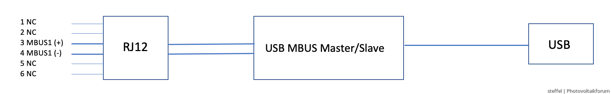

# Kaifa MA309 Smart Meter Logger

## Overview

This script was made to read out the new Smart Meter "Kaifa MA309"
used by Austrian power grid operators, here TINETZ.

Specification of the interface:
https://www.tinetz.at/fileadmin/user_upload/Kundenservice/pdf/Beschreibung_Kundenschnittstelle_Smart_Meter_TINETZ.pdf

Discussion about this script:
https://www.photovoltaikforum.com/thread/157476-stromz%C3%A4hler-kaifa-ma309-welches-mbus-usb-kabel/?pageNo=2#post2350873

Useful description of Frames:
https://www.gurux.fi/node/18232

This script was only tested with the above meter.

## Required Hardware

1. RJ12 6P6C Plug

    e.g. https://www.amazon.de/6P6C-Stecker-6-polige-Schraubklemmen-Adapterstecker-CCTV-Adapterstecker/dp/B07KFGS3BF
  
    **Note**: you have to cut off the plastic shell of the RJ12 plug to fit it into the socket of the MA309.
  
2. MBUS Slave module like this:

    https://www.amazon.de/JOYKK-USB-zu-MBUS-Slave-Modul-Master-Slave-Kommunikation-Debugging-Bus%C3%BCberwachung/dp/B07PDH2ZBV

## Config

Create a file `meter.json` to configure your serial connection 
parameters and your AES key.

A template file `meter_template.json` can be recycled for this.

The AES key format is "hex string", e.g. `a4f2d...`

### Export

Currently, the export to a file readable by Solarview (http://solarview.info/)
is supported.

- The config key `export_format` has to be set to `SOLARVIEW`
- The config key `export_file_abspath` has to be set to the absolute file path

## Installation

### Systemd automatic service

This installs and automatically starts a systemd service.

Install the debian package 

`sudo dpkg -i kaifareader_...deb`

If there are problems on missing packages, execute afterwards:

`sudo apt -f install`

## Start

### Automatically, if service is installed and running

Startup done, automatically.

Status of the service:

`sudo systemctl status kaifareader`

Start manually (e.g. after manually stopped)

`sudo systemctl start kaifareader`

### Manually

#### Foreground

`python3 kaifa.py`

#### Background

`nohup python3 kaifa.py &`

## Stop

### If service is installed and running

`sudo systemctl stop kaifareader`

### Foreground

Press CTRL+C

### Background

Possible by killing the process

